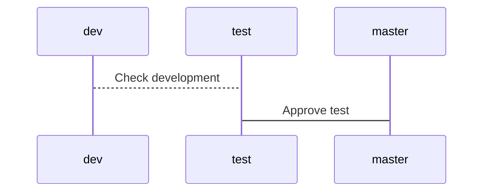

# Cart

Cart is my personal project for learn more about the wonderful language programming with **Nodejs** and **Domain-driven design**.

## Branchs

Branches for this project life cycle.

**master** : Production

**test** : Homologation

**dev** : Development



## Installation

Requires [Node.js](https://nodejs.org/) v5+ to run.

Install the dependencies and devDependencies.
```
npm install
```

Run project.

```
npm start
```